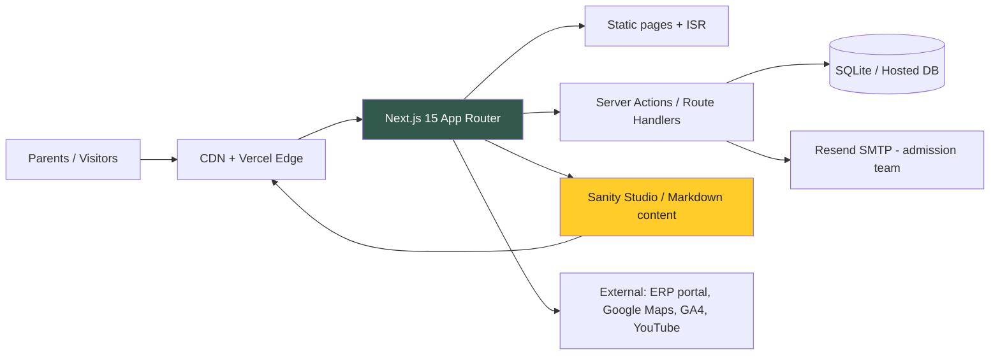

# The Orbis School — Modern Website Architecture & Implementation Plan

> **Handoff document for the coding system.** This plan is self-contained: it describes what to build, the architecture, the tech stack, the design system, the information architecture, the data model, and a bite-sized task list with exact commands. Read `orbis-content-reference.md` (same folder) for the full scraped content inventory, real copy, and asset URLs.

---

## 1. Project Overview

**Client:** The Orbis School (theorbisschool.com) — a top CBSE school group in Pune, India (Preschool → Class 12), with 3 campuses: **Keshav Nagar**, **Mundhwa**, **Gahunje**.

**Task:** Rebuild the current site as a **modern, clean, fast, mobile-first website** using current-generation technology. The existing site is a legacy jQuery + Bootstrap 5.2 + Owl Carousel server-rendered app (Drupal/PHP-style POST forms, no front-end framework) and feels dated.

**Primary audience:** Parents of prospective students (age 2–17) researching CBSE schools in Pune, then submitting an admission enquiry. Secondary: current parents (ERP links, calendar, circulars), international students, prospective staff/vendors/franchisees.

**Business goals:**
1. Increase admission-enquiry conversions (the #1 conversion action).
2. Position Orbis as a modern, premium CBSE school (trust + quality signal).
3. Clearly present the 3 campuses and the Pre-primary→Class 12 academic journey.
4. Be fast (Core Web Vitals green), accessible, SEO-optimised for "best CBSE school in Pune / Keshav Nagar / Mundhwa / Gahunje".
5. Keep all existing content/navigation; reorganise where it improves clarity.

**Brand signals scraped from the live site:**
- Tagline: **"Empowering Mind, Energising Being"**
- Mission: "Igniting the young minds… tradition harmonises with modernity"
- Colours in use: deep green `#33594c`, gold `#FFCC29`, white; secondary pink `#FAC` in legacy CSS
- Logo: `https://www.theorbisschool.com/images/orbis-logo.png` (orb/globe motif — "Orbis" = orb = the world)
- Voice: warm, aspirational, parent-focused ("Learners today, Leaders tomorrow", "Celebrate Learning")

---

## 2. Goals & Non-Goals

**Goals**
- Next-generation front-end framework, static-first rendering, green Core Web Vitals.
- Full responsive redesign with a design system (tokens, components).
- Complete content parity with the existing ~62-page site (sitemap in §6).
- Admission enquiry + contact forms wired to a working backend.
- SEO: metadata, structured data (School/Organization, FAQPage, BreadcrumbList), sitemap.xml, robots.txt.
- Analytics (GA4) + consent-aware tag setup.

**Non-goals (v1)**
- No login/ERP rebuild — link out to existing ERP/parent portals.
- No online fee payment — fee page is informational; link to bank/portal instructions.
- No CMS migration of the live database — content is imported once as structured data (see §9).

---

## 3. Tech Stack (latest-gen, justified)

| Concern | Choice | Why |
|---|---|---|
| Framework | **Next.js 15+ (App Router, React 19)** | RSC + Server Components, static export or ISR, best-in-class DX, Vercel-native |
| Language | **TypeScript (strict)** | Contract for the content model, catch errors at build time |
| Styling | **Tailwind CSS v4** | Utility-first, CSS-first config, tiny runtime, design tokens via `@theme` |
| UI primitives | **shadcn/ui (Radix UI) + lucide-react icons** | Accessible, copy-pasteable, themable; fast to build a consistent design system |
| Motion | **Motion (framer-motion successor, `motion` package)** or CSS-only for critical paths | Scroll reveals, hero transitions, micro-interactions; keep animation CSS where possible for perf |
| Content | **Headless CMS: Sanity Studio** (recommended) **or Git-based Markdown/MDX** (zero-credential fallback) | Editorial team updates copy without deploys; see §9 adapter pattern — the site must build with the fallback so the coding system can run it with no API keys |
| Forms | **Next.js Server Actions + Resend email** (needs `RESEND_API_KEY`) with a **no-key fallback**: store submissions to a local JSON/SQLite + mailto link | Admission enquiry is the core conversion; must have a working path without paid keys |
| Data layer | **SQLite (better-sqlite3) or JSON files** for enquiries/leads in dev; swap to a hosted DB in prod | Zero-config, real persistence for the handoff |
| Images | **next/image** (AVIF/WebP, responsive, blur placeholders) | LCP control; hero must be optimised |
| Deployment | **Vercel** (primary) — output: static export compatible for any static host | Zero-ops; preview URLs per branch |
| Quality | **ESLint + Prettier + Vitest + Playwright** | Lint/format/test/E2E gates before merge |

**Version pins (as of Aug 2026):** Next.js `^15` (or latest stable 16.x if available), React `^19`, Tailwind `^4`, TypeScript `^5`, Node `>=20` (use `.nvmrc` / `"engines"`). Pin exact versions in `package.json` after scaffolding with `create-next-app@latest`.

---

## 4. System Architecture



**Key decisions**
- **Static-first**: all marketing pages are statically generated at build time (fast, cheap, SEO-perfect). Revalidate on CMS content change via ISR/webhooks.
- **Server Actions** handle the enquiry/contact forms (no client API sprawl, no extra backend service needed in v1).
- **Headless CMS with a content adapter**: pages read content from a typed `ContentSource` interface. Two implementations: `sanitySource` and `markdownSource`. The markdown source ships in-repo under `/content`, so the project builds and runs with zero external credentials; Sanity is enabled when env keys exist. (This is the "runs out of the box" guarantee for the coding system.)
- **No heavy client JS**: RSC renders most content; client components are isolated (`use client`) only for interactive islands — mobile nav, accordions, carousel, counters, forms, map embeds.
- **Security**: Server Actions validate with Zod; rate-limit enquiries (per-IP + honeypot); env vars only server-side; `next/image` remote patterns allowlist for the legacy media host.

---

## 5. Design System

### 5.1 Tokens (Tailwind v4 `@theme`)

```css
--color-brand-900: #1F3D33;   /* deep green (darkest) */
--color-brand-700: #2C5142;   /* primary green  */
--color-brand-600: #33594C;   /* brand green (from live site) */
--color-brand-500: #4A7A66;
--color-brand-100: #E7EFEB;   /* tint background */
--color-accent-400: #FFD94D;
--color-accent-500: #FFCC29;  /* gold (from live site) */
--color-accent-600: #E6B400;
--color-ink-900: #14211C;     /* headings */
--color-ink-600: #4A5A52;     /* body text */
--color-paper: #FBFBF7;       /* warm off-white page bg */
--color-white: #FFFFFF;

--font-sans: "Plus Jakarta Sans", ui-sans-serif, system-ui, sans-serif;
--font-display: "Fraunces", ui-serif, Georgia, serif;   /* elegant editorial headings */

--radius: 1rem (cards), 9999px (pills/buttons);
--shadow: soft layered shadows (no harsh borders);
```

**Fonts:** Google Fonts — **Plus Jakarta Sans** (body, friendly-modern) + **Fraunces** (display headings, premium-education feel). Preload both, `font-display: swap`, subset latin.

### 5.2 Visual language ("Modern, Clean, Premium Education")
- **Layout:** generous whitespace, max-width `1140–1280px` containers, 12-col grid, consistent 80/64/48/32/24/16 spacing scale.
- **Colour:** white/off-white backgrounds with deep-green sections for contrast; gold used sparingly for CTAs, highlights, badges.
- **Type scale:** display 56–72px hero, h1 44–56, h2 32–40, h3 24–28, body 16–18px, `line-height` 1.5–1.6.
- **Cards:** rounded-2xl, soft shadow, image top with hover lift + gold underline accent.
- **Buttons:** pill-shaped; primary = gold `#FFCC29` with dark-green text (highest contrast for CTA); secondary = green outline; ghost = white on dark.
- **Imagery:** use existing site assets (real campus photos — trust signal). Hero: full-bleed image with green gradient overlay + headline + CTA. Section headers: small gold kicker + Fraunces heading + body.
- **Motion:** scroll-reveal fade-up (respect `prefers-reduced-motion`), hero image ken-burns, counter animation, subtle hover states. Nothing blocks content.
- **Microcopy:** "Admissions Open 2026–27", "Book a Campus Visit", "Download Fee Structure".

### 5.3 Component inventory (shadcn/ui base where noted)
Layout: `Header (sticky, mega-menu)`, `Footer (4-col + newsletter)`, `MobileNav`, `Breadcrumbs`, `TopBar (campus switcher + ERP login)`.
Blocks: `HeroSlider`, `StatCounter` (student enrollment), `CampusCard`, `PageHero` (interior pages), `SectionHeading`, `MediaText`, `TestimonialCarousel`, `NewsCard`, `EventList`, `Accordion (FAQ)`, `CTABand`, `GalleryGrid` (lightbox), `TeamCard`, `ContactInfoCard`, `MapEmbed`.
Forms: `EnquiryForm` (campus select + Zod validation), `ContactForm`, `CareersForm`, `NewsletterForm`.
UX: `SkipLink`, `FocusTrap` (dialogs), `Toast` (form success), `ShareButtons`.

---

## 6. Information Architecture (Sitemap)

Flat, crawlable URLs mirroring the current site (SEO preservation — keep slugs where possible):

```
/                          Home
/about/why-orbis           Why The Orbis School (overview, vision, mission)
/about/directors-message
/about/awards
/about/knowledge-partners
/about/facilities
/about/core-practices
/about/alumni
/admissions/process
/admissions/enquiry        (form)
/admissions/fee-structure
/admissions/international
/life/events
/life/gallery
/life/transport
/life/school-song
/life/outdoor-activities
/life/progress-promotion
/life/discipline
/life/diary-rules
/life/newsletter
/academics/cbse
/academics/pedagogy
/academics/preschool            (Pre-primary)
/academics/lower-primary        (1st–5th)
/academics/upper-primary        (6th–8th)
/academics/secondary            (9th–10th)
/academics/senior-secondary     (11th–12th)
/co-scholastic/greater-education-programme
/co-scholastic/ssr
/co-scholastic/literary-activities
/co-scholastic/leadership
/co-scholastic/orbieventum
/co-scholastic/ncc
/campuses/keshav-nagar          (+ /key-highlights, /principal-message, /discipline, /pedagogy, /admission-inquiry)
/campuses/mundhwa               (+ same sub-pages)
/campuses/gahunje               (+ same sub-pages, /headmistress-message)
/resources/blog                 (list + /blog/[slug])
/resources/orbinews             (news list)
/resources/faqs
/contact
/contact/careers
/contact/vendors
/contact/franchise
```

Top-level nav (desktop, 7 items max): **About Us · Admissions · Life at Orbis · Academics · Co-Scholastic · Campuses · Resources · Contact** (+ prominent "Admission Enquiry" gold button).

---

## 7. Page Blueprints (key templates)

### 7.1 Home (`/`)
1. **TopBar:** campus select, ERP/parent portal link, phone.
2. **Header:** sticky, logo, nav, gold "Admission Enquiry" CTA, hamburger on mobile.
3. **Hero slider:** 4–6 real campus images; headline "Admissions Open 2026–27 · Learners today, Leaders tomorrow"; dual CTA (Enquire Now / Book Campus Visit); trust chips (CBSE, 3 Campuses, Pre-primary to Class 12).
4. **Marquee/ticker:** upcoming events (Rakshabandhan, Milad-un-Nabi, Founders' Day, Independence Day, OrbiLoqui…).
5. **About intro:** "Top CBSE School in Pune" + image + link to Why Orbis.
6. **Stats band:** Student Enrollment, Toppers (Class 10/12), Campuses, Years (counters).
7. **Campuses:** 3 cards (Keshav Nagar, Mundhwa, Gahunje) with images + links.
8. **Academic journey:** 5 cards (Preschool → Senior Secondary).
9. **Facilities highlights:** sports (cricket, football, archery, skating, basketball, TT, chess, gymnastics), labs (Science, Math, AI & Robotics, Language, Computer).
10. **Co-scholastic strip:** GEP, SSR, OrbiEventum, NCC, Leadership, Literary.
11. **Testimonials carousel** (parent quotes from live site).
12. **Blog/News preview:** 3 latest posts.
13. **CTA band:** "Start your child's journey — Admissions Open".
14. **Footer:** contact, quick links, associations, social, newsletter.

### 7.2 Interior template (all informational pages)
`PageHero (title + breadcrumb + gold kicker)` → `RichText content blocks` → `aside: "Other Links" (section nav)` → `CTA band` → `footer`. Supports: vision/mission, messages, awards grid, facilities feature grid, FAQ accordion, team, gallery.

### 7.3 Admission process (`/admissions/process`)
Stepper (1 Fill enquiry → 2 Counsellor contact → 3 Campus visit → 4 Document submission → 5 Confirmation) + inline `EnquiryForm` + fee CTA.

### 7.4 Contact (`/contact`)
3 campus cards (address, phones, emails, Google Map embed per campus) + `ContactForm` + "Our Associations" (Wissen Education Foundation) note.

### 7.5 Blog/News (`/resources/blog`, `[slug]`)
Card grid with tags (#Parent, #CBSE Students, #Future Skills…) → article page with prose styling, share buttons, related posts.

---

## 8. Content & Data Model

Typed with Zod (single source of truth, shared by CMS adapter and DB schema).

```ts
type Campus = "keshav-nagar" | "mundhwa" | "gahunje";
type Page = {
  slug: string; title: string; metaTitle: string; metaDescription: string;
  heroImage: string; kicker?: string; bodyBlocks: Block[]; // RichText, MediaText, Stats, Accordion, Cards
  sidebarLinks?: { label: string; href: string }[];
  campus?: Campus;
};
type Post = { slug: string; title: string; excerpt: string; tags: string[]; date: string; coverImage: string; body: Block[] };
type Testimonial = { id: string; quote: string; author: string; role: string; campus?: Campus };
type Event = { title: string; date: string; type: "holiday" | "activity" | "exam" | "meeting" };
type Enquiry = { id: string; campus: Campus; parentName: string; email: string; phone: string; childName?: string; grade?: string; message?: string; createdAt: string; status: "new" };
type CampusInfo = { campus: Campus; address: string; phone: string[]; email: string; mapEmbedUrl: string };
```

**Sources:** `/content/pages/*.md` (markdown fallback, ships in repo — prepopulated with the scraped copy), `/content/posts/*.md`, `/content/testimonials.json`, `/content/events.json`, `/content/campuses.json`. Same shape served by Sanity when configured.

**Media:** import/copy key legacy assets (`/images/...`) into `/public/assets/` — hero sliders, campus photos, about images, logo. `next.config.ts` sets `images.remotePatterns` for `www.theorbisschool.com` so un-imported images still work during migration.

---

## 9. Backend / Integrations

1. **Enquiry/Contact forms → Server Actions**
   - `app/api/enquiry/route.ts` (or Server Action `enquiry(formData)`) with Zod validation, honeypot field, per-IP rate limit (in-memory + SQLite).
   - Persist to SQLite `enquiries` table (better-sqlite3, WAL mode) — real, queryable leads.
   - Email notify via Resend when `RESEND_API_KEY` present; otherwise log + store (no silent failure).
2. **Newsletter:** store email addresses (opt-in) in SQLite.
3. **External links (unchanged URLs):** ERP login, school calendar, circulars, transfer certificate, mandatory disclosure — deep-link from campus pages (list scraped from `/keshav-nagar-pune`).
4. **Analytics:** GA4 via `@next/third-parties` GoogleAnalytics component + consent banner (localStorage).
5. **Maps:** Google Maps embed iframe per campus (lazy-loaded).

---

## 10. SEO, Performance, Accessibility

- **SEO:** unique titles/descriptions per page; canonical URLs; `sitemap.ts`; `robots.ts`; JSON-LD: `School` + `Organization` (home), `FAQPage` (FAQs), `BreadcrumbList` (interior), `Article` (blog). Target keywords preserved: "best CBSE school in Pune/Keshav Nagar/Mundhwa/Gahunje", "CBSE preschool Pune", "admission 2026-27".
- **Performance:** static rendering, `next/image` with correct sizes/priority on LCP hero, preload hero image, lazy-load below-fold, `font-display: swap` + preconnect, bundle-split client islands, no layout shift (fixed aspect ratios for images/carousel), Lighthouse targets: LCP < 2.5s, CLS < 0.1, INP < 200ms.
- **A11y:** semantic landmarks, skip link, focus-visible styles, ARIA for carousel/accordion/dialog, 4.5:1 contrast (gold CTA uses dark-green text), form labels + error announcements, `prefers-reduced-motion` respected, keyboard-navigable mega menu.

---

## 11. Implementation Tasks (bite-sized, ordered)

> Commands assume repo root. Run in order. Commit after each task. The coding system may execute tasks 1–12; 13+ is deployment hardening.

### Task 1: Scaffold project
```bash
npx create-next-app@latest orbis-website --typescript --tailwind --eslint --app --src-dir --import-alias "@/*"
cd orbis-website && npm i motion lucide-react zod better-sqlite3 clsx tailwind-merge
```
**Verify:** `npm run dev` → http://localhost:3000 renders default page.

### Task 2: Design tokens & global styles
- Create `src/app/globals.css` with Tailwind v4 `@theme` tokens (§5.1), font imports, base styles.
- Add `next.config.ts` (`images.remotePatterns` for theorbisschool.com).
- `npm i @fontsource/plus-jakarta-sans @fontsource/fraunces` (self-host, no runtime Google request) or link preconnect + Google Fonts.
**Verify:** page bg is `--color-paper`, a test heading renders Fraunces.

### Task 3: Content layer (markdown fallback)
- Create `src/lib/content-source.ts` (interface), `src/lib/markdown-source.ts` (fs + gray-matter; install `gray-matter`), `src/lib/schema.ts` (Zod types §8).
- Populate `/content/campuses.json`, `/content/testimonials.json` (copy from content reference file), `/content/events.json`, first 3 pages in `/content/pages/`.
**Verify:** `tsc --noEmit` clean; a tiny test reads a page and returns typed data.

### Task 4: Layout shell — Header, TopBar, Footer, MobileNav
- `src/app/layout.tsx` with metadata, fonts, GA4 placeholder, `<Header/>`, `<Footer/>`.
- Header: sticky, logo (use legacy `/images/orbis-logo.png` via public assets), nav from §6, gold CTA → `/admissions/enquiry`.
- Footer: 4 columns + newsletter form (action → Server Action stub).
**Verify:** nav toggles on mobile; all internal links resolve (no 404s).

### Task 5: Home page
- Build blocks per §7.1: HeroSlider (CSS-only transition + `use client` island), StatsBand (counter), CampusCards, AcademicJourney, FacilitiesGrid, CoScholasticStrip, TestimonialCarousel, NewsPreview, CTABand.
- Fetch data from content layer (server component).
**Verify:** home renders all sections with content; Lighthouse mobile pass ≥ 90 perf.

### Task 6: Interior page template + content pages
- `src/app/[...slug]/page.tsx` (catch-all) + `PageHero`, `RichText`, `SidebarLinks`, `CTABand`.
- Add remaining `/content/pages/*.md` for all §6 URLs (use the content reference; copy can be trimmed but must be real).
**Verify:** every sitemap URL returns 200 with content; breadcrumbs correct.

### Task 7: Campus pages
- `src/app/campuses/[campus]/page.tsx` + sub-pages (key-highlights, principal/headmistress-message, discipline, pedagogy, admission-inquiry).
- Data from `campuses.json` + page markdown; include ERP/portal links per campus.
**Verify:** 3 campuses × sub-pages all render; contact details correct (from content reference).

### Task 8: Blog & news
- `src/app/resources/blog/page.tsx` (grid + tag filter) + `src/app/resources/blog/[slug]/page.tsx` (prose, share, related).
- Import 5+ real posts from the live blog (content reference has titles/excerpts).
**Verify:** post list + detail render; tags filter works.

### Task 9: Forms — enquiry, contact, newsletter, careers
- `src/lib/actions.ts`: `submitEnquiry`, `submitContact`, `subscribeNewsletter` — Zod validate, honeypot, rate limit, persist to SQLite (`src/lib/db.ts` with better-sqlite3; auto-create tables; WAL), optional Resend email.
- `EnquiryForm` (campus select), `ContactForm`, `NewsletterForm` with success/error toasts and accessible status.
**Verify:** submitting a test enquiry inserts a row in `enquiries.db` and shows success toast; invalid input shows field errors.

### Task 10: SEO layer
- `src/app/sitemap.ts`, `src/app/robots.ts`, JSON-LD components (School/Organization on home, FAQPage, BreadcrumbList, Article), per-page metadata from content layer.
**Verify:** `/sitemap.xml` lists all URLs; structured-data validator passes on home/FAQ/blog.

### Task 11: Quality gates
- `npm i -D vitest @testing-library/react @playwright/test` (or `npx playwright install`).
- Unit tests: content source, schema validation, form actions (valid/invalid/honeypot).
- E2E smoke: home loads, nav works, enquiry submit succeeds.
- `npm run lint`, `npx tsc --noEmit`, `npm test`, `npx playwright test` all green.
**Verify:** CI-style command sequence exits 0.

### Task 12: Build + static export check
```bash
npm run build
npm start  # or: npx serve out (if output:'export')
```
**Verify:** build succeeds with no type errors; all routes pre-rendered; production server serves home fast.

### Task 13 (prod): Sanity CMS adapter + deployment
- Optional: `npm i next-sanity sanity`, add `sanitySource` implementing the same `ContentSource` interface; point env `SANITY_PROJECT_ID`.
- Deploy: push to GitHub → Vercel project (framework preset Next.js) → set env vars → custom domain `www.theorbisschool.com` (DNS CNAME) → GA4 property → SMTP/Resend domain verify → rewrite or redirect legacy deep links.

### Task 14 (prod): Monitoring & handover
- Vercel Analytics, error monitoring (Sentry optional), uptime check.
- Handover doc: how to edit content (markdown or Sanity), env var table, how to deploy, rollback plan.

---

## 12. Risks & Tradeoffs

| Risk | Mitigation |
|---|---|
| Legacy image hosts slow/serve mixed content | Import key assets into `/public`; remotePatterns fallback; AVIF/WebP via next/image |
| Content volume (~60 pages) delays launch | Ship all URLs with rich-but-trimmed copy from content reference; expand later |
| Sanity adds setup friction for the coding system | Markdown source is the default so the repo runs keyless; Sanity is additive |
| better-sqlite3 native module in some hosts | Pin Node ≥ 20 LTS; on serverless, swap to hosted Postgres (same schema via adapter) |
| SEO loss if slugs change | Keep current slugs exactly where possible (§6) |
| Form spam | Honeypot + rate limit + (prod) Cloudflare Turnstile |

## 13. Acceptance Criteria (definition of done)

- [ ] `npm run build && npm start` serves all §6 URLs with real content, no 404s.
- [ ] Enquiry form persists a row and emails (when key set); validation + honeypot proven by tests.
- [ ] Lighthouse mobile: Perf ≥ 90, A11y ≥ 95, SEO ≥ 95, Best Practices ≥ 90.
- [ ] Keyboard-only and screen-reader smoke test of nav, forms, carousel, FAQ.
- [ ] `sitemap.xml`, `robots.txt`, JSON-LD validated.
- [ ] Design matches §5 tokens: green/gold, Fraunces headings, pill CTAs, generous spacing.
- [ ] README with env table + content-editing instructions.

---

## 14. Open Questions for the Client
1. Keep legacy slug structure or accept cleaner new URLs with 301 redirects?
2. CMS preference: Sanity (hosted, paid) vs Git-based markdown (free)?
3. Do they need an online fee-payment flow in scope (currently informational only)?
4. Which legacy media should be re-photographed vs reused?
5. Multi-language (Marathi/Hindi) in scope?
